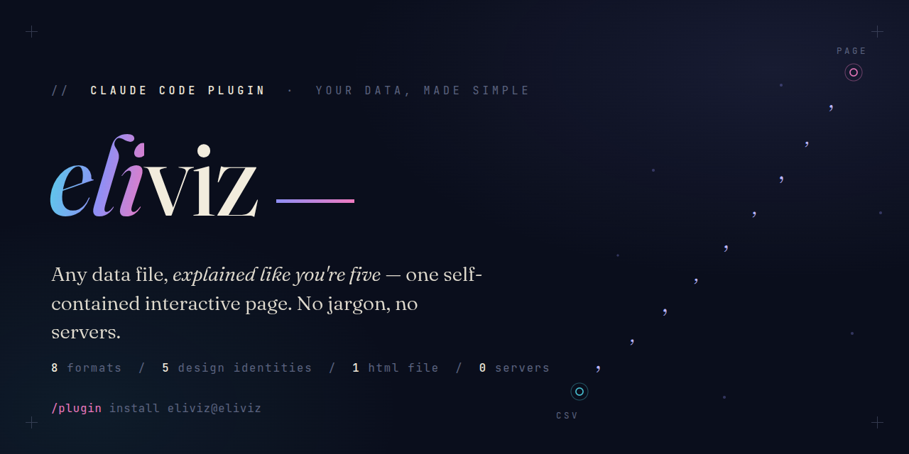
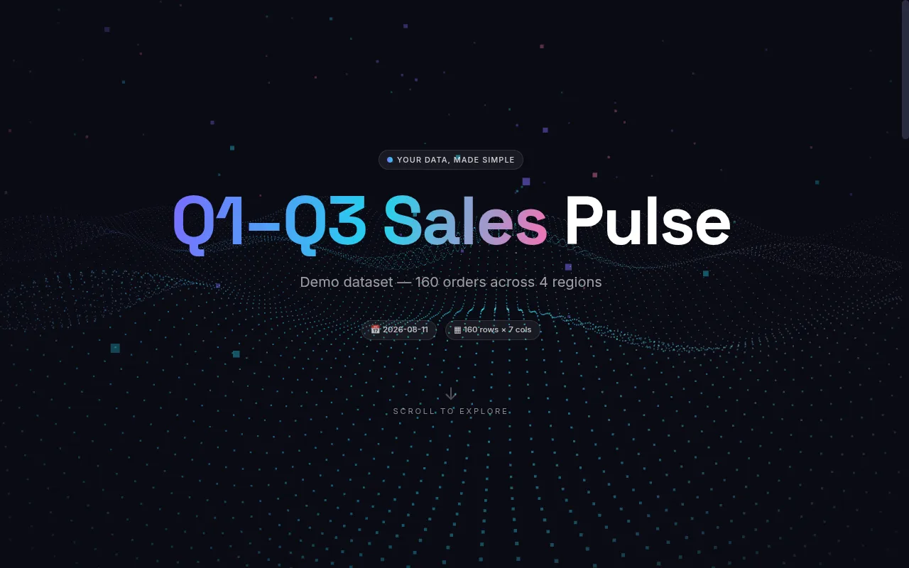
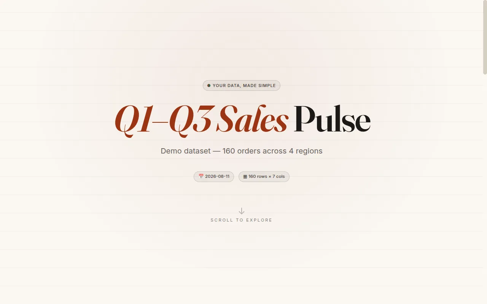
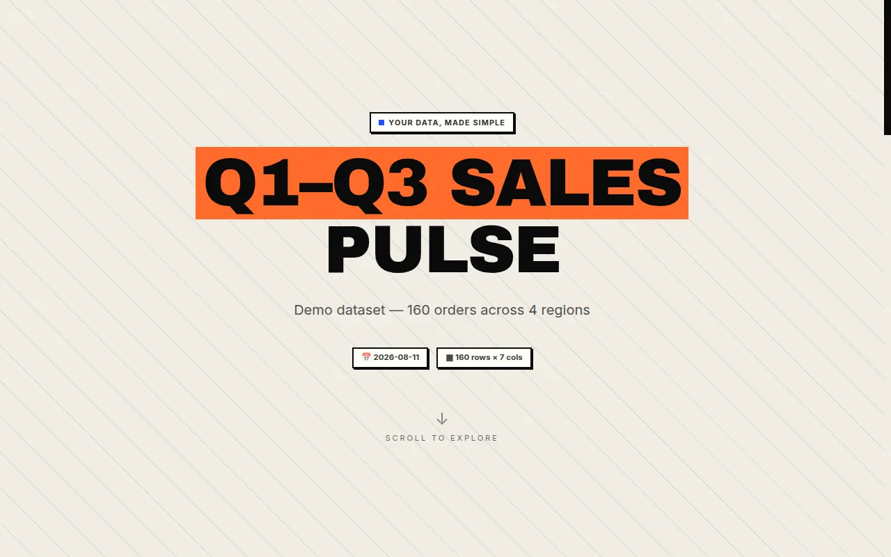
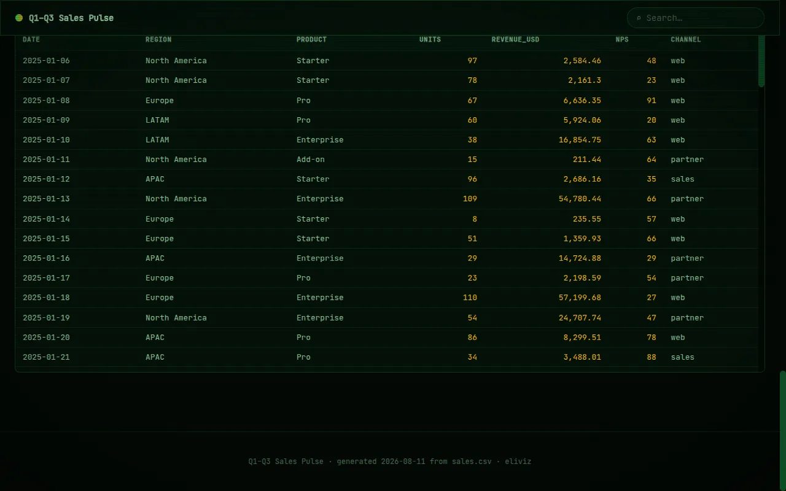
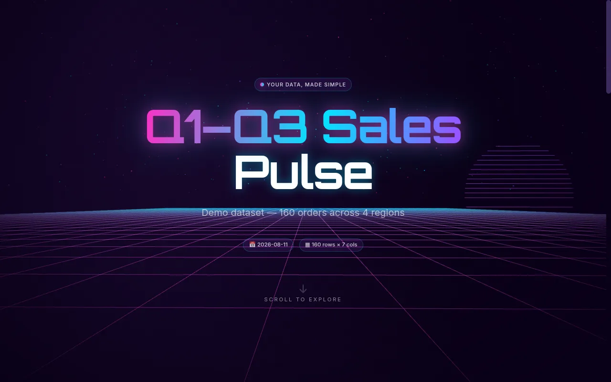
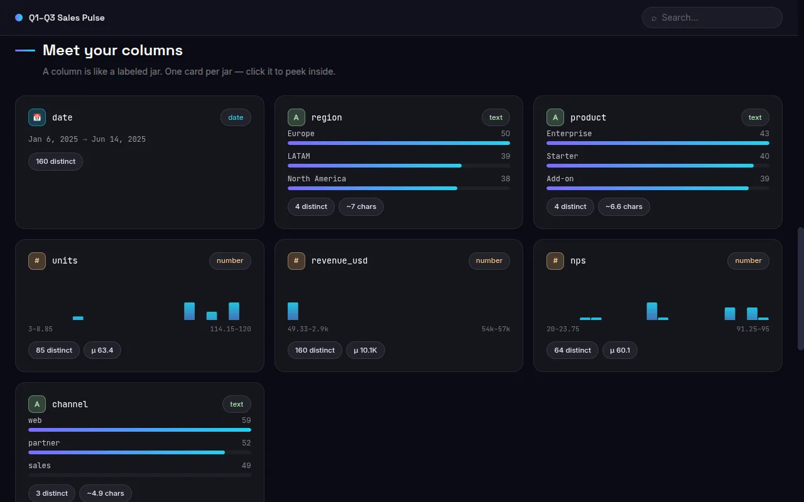

<div align="center">



<p>


<a href="https://code.claude.com/docs/en/plugins"></a>
</p>

<p><b>Install in Claude Code — two commands:</b></p>

</div>

```
/plugin marketplace add costiash/eliviz
/plugin install eliviz@eliviz
```

You have a CSV, a log file, a SQLite database, a Markdown report. Someone needs to *see* it — not in a spreadsheet, not in `less`, but as something you'd actually present. eliviz turns any of those files into one polished, interactive HTML page: animated hero, live stat counters, charts, profiled tables. One file you can email, drop in Slack, or open from a USB stick — no server, no internet required.

## 💬 Usage

Just ask. Examples:

| What you say | What you get |
|---|---|
| "Visualize this CSV" | Auto-profiled interactive page with charts, counters, and a sortable table |
| "Make a viewer for these logs" | Level-filterable log viewer, built for scanning |
| "Turn this report into a page for the board" | Polished document page with outline navigation |
| "Visualize this in our brand colors: #0a2540 and gold" | Custom design pack in your palette, contrast-verified |
| "I want the editorial layout but dark" | A blend — editorial structure, dark treatment |

## 🧒 The ELI5 voice — where the name comes from

**eliviz = ELI5 + viz.** What makes it unique isn't the charts — it's the words around them. Every page speaks in a mandatory plain-English voice (`[MODE: ELI5_FOR_DUMMIES]`, baked verbatim into the skill): a smart 10-year-old could read any label on the page and get it.

So instead of dashboard jargon, generated pages say things like:

> "One row = one record" · "A column is like a labeled jar — click it to peek inside" · "A log is a diary your software writes" · "Errors: things that broke" · "Dig in — like folders inside folders"

The hero opens with *"Your data, made simple"* and defaults to *"A simple tour of X. No jargon."* The voice is enforced end to end: it's a required section in the skill, an item in the output-expectations checklist, a note in the design spec so template edits keep it, and a guardrail in the design-adapter agent — every generated page complies out of the box.

One deliberate boundary: the rule covers the **page's own words only**. Your data — column names, cell values, log lines — is never rewritten.

## 🎨 Design bank

Five identities ship in the bank. eliviz picks one based on your data and how you phrase the request, or you choose with `--design <id>`. Same dataset ("Q1–Q3 Sales Pulse"), five looks — plus a peek inside the page body:

<table>
  <tr>
    <th width="50%" align="center">🌌 aurora — dark glass, particle-wave hero <i>(default)</i></th>
    <th width="50%" align="center">📰 editorial — warm paper, serif type</th>
  </tr>
  <tr>
    <td align="center"></td>
    <td align="center"></td>
  </tr>
  <tr>
    <th align="center">⬛ brutalist — hard borders, offset shadows</th>
    <th align="center">🖥️ terminal — phosphor CRT, code-rain hero</th>
  </tr>
  <tr>
    <td align="center"></td>
    <td align="center"></td>
  </tr>
  <tr>
    <th align="center">🌆 neon — cyberpunk glow, synthwave-grid hero</th>
    <th align="center">🔍 inside every page — columns profiled</th>
  </tr>
  <tr>
    <td align="center"></td>
    <td align="center"></td>
  </tr>
</table>

<p align="center"><i>Bottom-right: the page body — every column profiled, types detected, distributions drawn. "A column is like a labeled jar."</i></p>

Want something off-menu? The design-adapter agent builds custom packs — your brand colors, a mood, or a blend of bank styles — and screenshot-verifies contrast before handing the page back.

## ✨ Features

- **ELI5 voice** — all page copy passes the "smart 10-year-old" test; your data itself is never touched
- **Any input** — CSV, TSV, Excel, SQLite, JSON/JSONL, Markdown, plain text, logs
- **One file out** — GSAP, three.js, and Tailwind inlined; fully offline-capable (`--cdn` for smaller files)
- **Animated hero** — three.js particle field with GSAP-driven entrance
- **Stat counters & SVG charts** — key numbers animate in, charts built from your actual data
- **Column-profiled tables** — sortable, with per-column type detection and distribution cards
- **Outline reading view** — Markdown and text documents become navigable pages
- **Log viewer** — level-filterable, built for scanning
- **Deterministic parsing** — bundled Python, stdlib only (openpyxl needed just for Excel)
- **Five design identities** — auto-picked per dataset, or forced with `--design <id>`
- **Design-adapter agent** — custom packs from brand colors, moods, or blends of bank styles, screenshot-verified for contrast before delivery

## ⚙️ How it works

A bundled Python script (stdlib only) parses your file deterministically and profiles every column. Claude then composes the page — hero, stats, charts, tables — using a design identity from the bank or a custom pack from the design-adapter agent. Everything is inlined into one HTML file that works offline.

## ▶️ Live demos

All five designs rendered on the same demo dataset — `aurora.html`, `editorial.html`, `brutalist.html`, `terminal.html`, `neon.html` — are attached to the [latest release](https://github.com/costiash/eliviz/releases/latest). Download one and open it. No server needed; that's the point.

## 📄 Requirements & license

- **Python** for parsing — standard library only; `openpyxl` is needed only for Excel files.
- **MIT licensed.** Generated pages inline vendored libraries under their own terms: [GSAP](https://gsap.com/community/standard-license/) (standard license), [three.js](https://github.com/mrdoob/three.js) (MIT), [Tailwind CSS](https://github.com/tailwindlabs/tailwindcss) (MIT).
